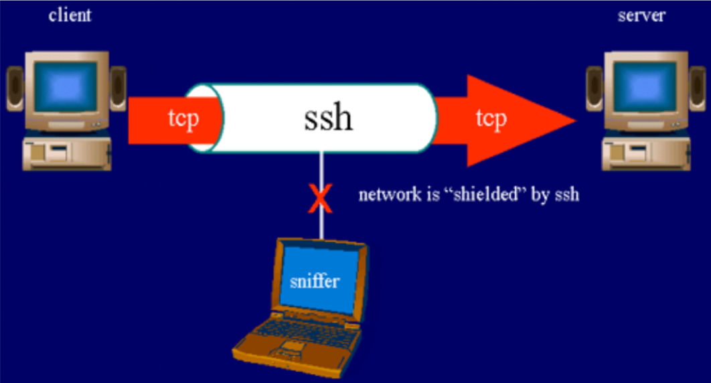
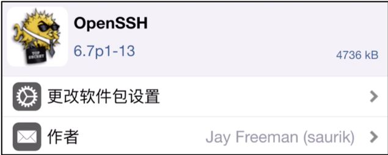
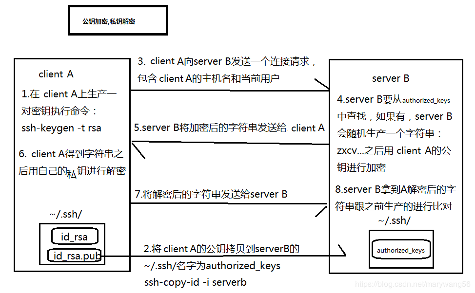

# Mac远程登录iPhone

- iOS和Mac OS X都是基于Darwin（苹果的一个基于Unix的开源系统内核），所以iOS中同样支持终端的命令行操作
- 在逆向工程中，我们经常会通过命令行来操纵iPhone
- 为了能够让Mac终端中的命令行能作用在iPhone上，我们得让Mac和iPhone建立连接
- 通过Mac远程登录到iPhone的方式建立连接


## SSH
Secure Shell的缩写，意为“安全外壳协议”，是一种可以为`远程登录`提供安全保障的协议  
使用SSH，可以把所有传输的数据进行加密，“中间人”攻击方式就不可能实现，能防止DNS欺骗和IP欺骗



很多人会将`SSH、OpenSSH、SSL、OpenSSL`搞混

* SSL  
`Secure Sockets Layer`的缩写，是为网络通信提供安全及数据完整性的一种安全协议，在传输层对网络连接进行加密  

* OpenSSL  
SSL的开源实现  
绝大部分HTTPS请求等价于：HTTP + OpenSSL  
OpenSSH的加密就是通过OpenSSL完成的 


SSH协议一共2个版本 
- SSH-1
- SSH-2

现在用的比较多的是SSH-2，客户端和服务端版本要保持一致才能通信

查看SSH版本（查看配置文件的Protocol字段）
- 客户端：`/etc/ssh/ssh_config`
- 服务端：`/etc/ssh/sshd_config`

SSH的通信过程可以分为3大主要阶段
1. 建立安全连接
2. 客户端认证
3. 数据传输


## OpenSSH
在iPhone上通过Cydia安装OpenSSH工具（软件源http://apt.saurik.com）


`OpenSSH的具体使用步骤可以查看Description中的描述`

SSH是通过TCP协议通信，所以要确保Mac和iPhone在同一局域网下，比如连接着同一个WiFi

在Mac的终端输入`ssh 账户名@服务器主机地址`   
比如`ssh root@10.1.1.168`（这里的服务器是手机）  
初始密码`alpine`  
退出登录命令是`exit`


## 用户
iOS下有2个常用账户：`root、mobile`

- root：最高权限账户，$HOME是`/var/root`
- mobile：普通权限账户，只能操作一些普通文件，不能操作系统级别的文件，$HOME是`/var/mobile`

> 登录mobile用户：root mobile@服务器主机地址    
> root和mobile用户的初始登录密码都是alpine  
> 最好修改一下root和mobile用户的登录密码（登录root账户后，分别通过passwd、passwd mobile完成） 

## 建立安全连接
在建立安全连接过程中，服务器会提供自己的身份证明


如果客户端并无服务器端的公钥信息，就会询问是否连接此服务器


在建立安全连接过程中，可能会遇到以下错误信息：提醒服务器的身份信息发生了变更


如果确定要连接此服务器，删除掉之前服务器的公钥信息就行
```bash
ssh-keygen -R 服务器IP地址
```

或者直接打开known_hosts文件删除服务器的公钥信息就行
```bash
vim ~/.ssh/known_hosts
```
## 认证方式
SSH-2提供了2种常用的客户端认证方式
- 基于密码的客户端认证 
- 基于密钥的客户端认证

SSH-2默认会优先尝试“密钥认证”，如果认证失败，才会尝试“密码认证”

 


1. 在客户端生成一对相关联的密钥（Key Pair）：一个公钥（Public Key），一个私钥（Private Key）
- 使用`ssh-keygen`生成
- 生成的公钥：~/.ssh/id_rsa.pub
- 生成的私钥：~/.ssh/id_rsa

2. 把客户端的公钥内容追加到服务器的授权文件（~/.ssh/authorized_keys）尾部
- ssh-copy-id root@服务器主机地址
- 需要输入root用户的登录密码
- ssh-copy-id会将客户端~/.ssh/id_rsa.pub的内容自动追加到服务器的~/.ssh/authorized_keys尾部

> 注意：由于是在~文件夹下操作，所以上述操作仅仅是解决了root用户的登录问题（不会影响mobile用户）

如果配置了免密码登录后，还是需要输入密码，需要在服务器端设置文件权限

```bash
chmod 755 ~
chmod 755 ~/.ssh
chmod 644 ~/.ssh/authorized_keys
```

免登陆认证过程:



1. 客户端发送登录请求，ssh user@hostname
2. 服务器接受请求，将服务器的公钥 As 发送给客户端服务器生成会话ID(session id)，设为 p，发送给客户端。
3. 客户端生成会话密钥(session key)，设为 q，并计算 r = p xor q。客户端将 r 用 As 进行加密，结果发送给服务器。
4. 服务器用 Bs 进行解密，获得 r。服务器进行 r xor p 的运算，获得 q。
5. 服务器生成随机数 x，并用 Ac 加密后生成结果 S(x)，发送给客户端
6. 客户端使用 Bc 解密 S(x) 得到 x客户端计算 q + x 的 md5 值 n(q+x)，q为上一步得到的会话密钥客户端将 n(q+x) 发送给服务器
7. 服务器计算 q + x 的 md5 值 m(q+x)服务器比较 m(q+x) 和 n(q+x)，两者相同则认证成功。
8. 客户端和服务器通过 q 进行会话数据安全传输

## 使用usb登录
默认情况下，由于SSH走的是TCP协议，Mac是通过网络连接的方式SSH登录到iPhone，要求iPhone连接WiFi


为了加快传输速度，也可以通过USB连接的方式进行SSH登录
Mac上有个服务程序usbmuxd（它会开机自动启动），可以将Mac的数据通过USB传输到iPhone
`/System/Library/PrivateFrameworks/MobileDevice.framework/Resources/usbmuxd`


使用iproxy，会将设备上的端口号映射到电脑上的某一个端口
```bash
iproxy 2222 22
```

以上命令就是把当前连接设备的22端口(SSH端口)映射到电脑的2222端口，那么想和设备22端口通信，直接和本地的2222端口通信就可以了。  
因此，SSH连接设备就可以这样连接了：
```bash
ssh -p 2222 root@127.0.0.1
```

## 中文问题
默认情况下，iOS终端不支持中文输入和显示
解决方案：新建一个`~/.inputrc`文件，文件内容是:
```
// 不将中文字符转化为转义序列
set convert-meta off 
// 允许向终端输出中文
set output-meta on
// 允许向终端输入中文
set meta-flag on 
set input-meta on
```
