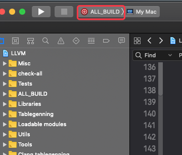
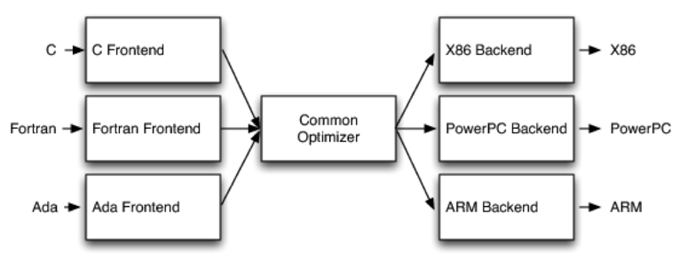
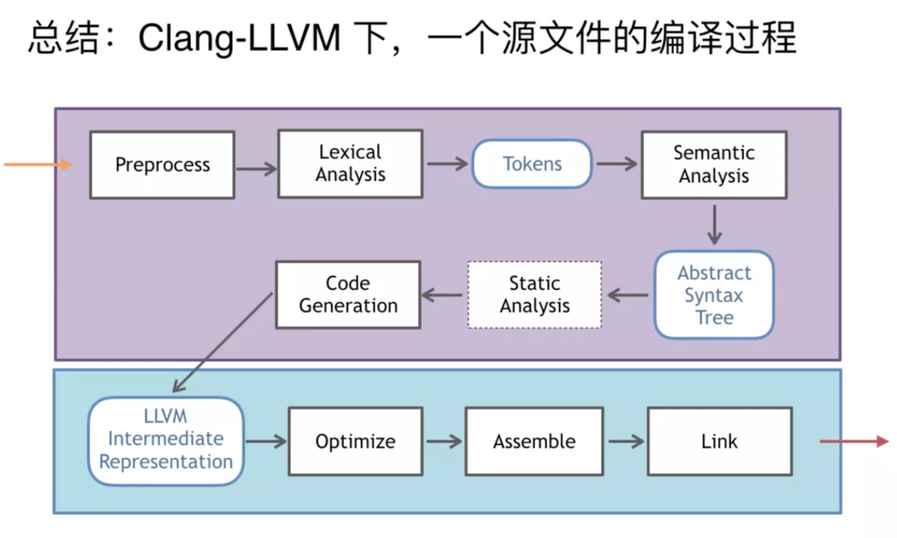
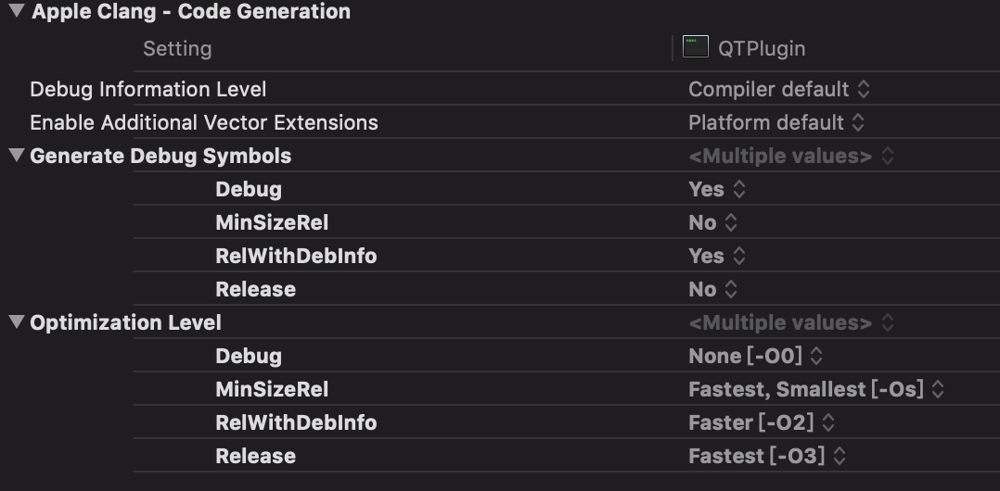
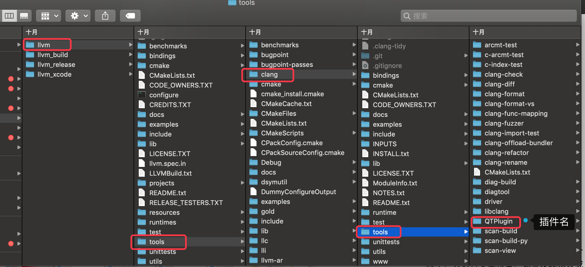
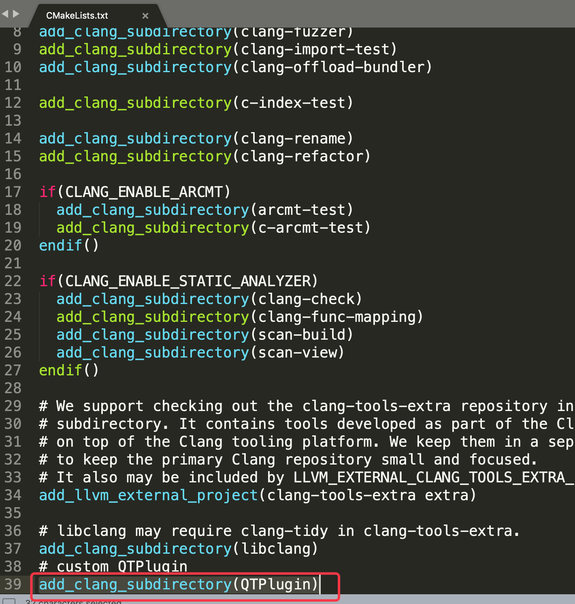
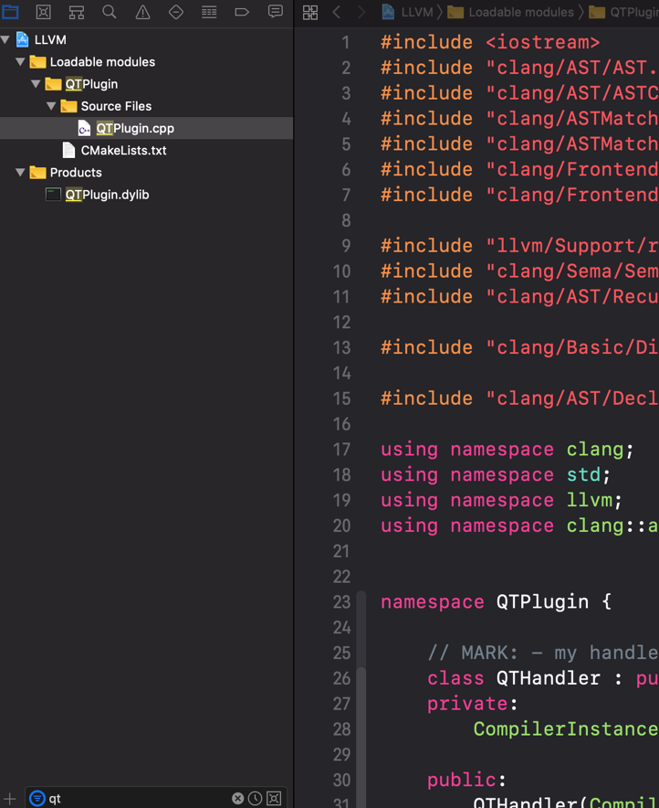
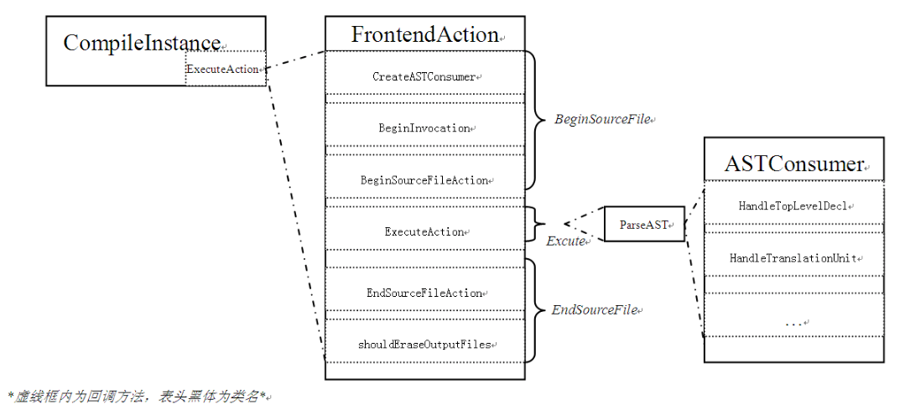
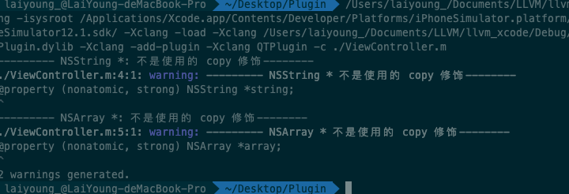

# LLVM & Clang 入门

本文主要从下面几个方面简单介绍了一下 LLVM & Clang。

[概述](#overview)

[快速入门](#quick_start)

[Clang 三大件](#clang_three)

[Xcode 编译过程](#xcode_compile_process)

[创建插件](#create_plugin)

[编写插件（实战）](#code_plugin)

[Xcode 集成 Plugin](#xcode_integrated_plugin)

## <span id="overview">概述</span>

`LLVM`包含三部分，分别是`LLVM suite`、`Clang`和`Test Suite`。

1. `LLVM suite`，LLVM 套件，它包含了 LLVM 所需要的所有工具、库和头文件，一个汇编器、解释器、位码分析器和位码优化器，还包含了可用于测试 LLVM 的工具和 clang 前端的基本回归测试。

2. `Clang`，俗称为 Clang 前端，该组件将`C`，`C++`，`Objective C`，和 `Objective C++`代码编译到 LLVM 的位码中。一旦编译到 LLVM 位代码中，就可以使用 LLVM 套件中的工具来操作程序。

3. `Test Suite`，测试套件，这是一个可选的工具，它是一套带有测试工具的程序，可用于进一步测试 LLVM 的功能和性能。

## <span id="quick_start">快速入门<span>

官方建议查看 Clang 的[入门文档](http://clang.llvm.org/get_started.html)，因为 LLVM 的文档可能已经过期。

#### Checkout LLVM:
    
* `$ cd 到放 LLVM 的路径下`

* `$ git clone https://git.llvm.org/git/llvm.git/`

#### Checkout Clang:
    
* `$ cd llvm/tools`

* `$ git clone https://git.llvm.org/git/clang.git/`

#### 配置和构建 LLVM 和 Clang:

这里有`Xcode`和`ninja`两种编译方式。

需要使用到的编译工具是[`CMake`](https://llvm.org/docs/CMake.html)，`CMake`的最低版本要求为`3.4.3`，不了解`CMake`的同学可以[戳我](http://www.hahack.com/codes/cmake/)进行入门了解。
安装`CMake`需要用到[`brew`](https://brew.sh/)，请确认`brew`已经安装。
使用`$ brew install cmake`命令即可安装`CMake`。

##### 方式一：使用 ninja 进行编译

使用`ninja`进行编译则还需要安装[`ninja`](https://ninja-build.org/)。
使用`$ brew install ninja`命令即可安装`ninja`。

1. 在`llvm`源码根目录下新建一个`llvm_build`目录，最终会在`llvm_build`目录下生成`build.ninja`。

2. 在`llvm`源码根目录下新建一个`llvm_release`目录，最终编译文件会在`llvm_release`文件夹路径下。

    * `$ cd llvm_build`
    
    * `$ cmake -G Ninja ../llvm -DCMAKE_INSTALL_PREFIX= 安装路径（本机为/Users/xxx/xxx/LLVM/llvm_release`，注意`DCMAKE_INSTALL_PREFIX`后面不能有空格。
    
3. 依次执行编译、安装指令。
    
    * `$ ninja`
    
    * `$ ninja install`

##### 方式二：使用 Xcode 进行编译
    
1. 在`llvm`源码根目录的同级下创建一个名为`llvm_xcode`的目录，并`$cd llvm_xcode`进入到`llvm_xcode`。

2. 编译命令：`cmake -G <generator> [options] <path to llvm sources>`

    **generator commands**:

    * `Unix Makefiles` — 生成和 make 兼容的并行的 makefile。

    * `Ninja` — 生成一个 Ninja 编译文件，大多数 LLVM 开发者使用 Ninja。

    * `Visual Studio` — 生成一个 Visual Studio 项目。

    * `Xcode` — 生成一个 Xcode 项目。

    **options commands**
    
    * `-DCMAKE_INSTALL_PREFIX=`"directory" — 安装 LLVM 工具和库的完整路径，默认`/usr/local`。

    * `-DCMAKE_BUILD_TYPE=`"type" — type 的值为`Debug`,`Release`, `RelWithDebInfo`和`MinSizeRel`，默认`Debug`。

    * `-DLLVM_ENABLE_ASSERTIONS=`"On" — 在启用断言检查的情况下编译，默认为`Yes`。

3. 这里我们使用`$ cmake -G Xcode ../llvm`命令生成一个`Xcode`项目。

4. 编译，选择`ALL_BUILD` Secheme 进行编译，预计`1+`小时。

     

## <span id="clang_three">Clang 三大件</span>

Clang 三大件分别是[`LibClang`](https://clang.llvm.org/doxygen/group__CINDEX.html)、[`Clang Plugins`](https://clang.llvm.org/docs/ClangPlugins.html)和[`LibTooling`](https://clang.llvm.org/docs/LibTooling.html)。

#### LibClang：

libclang 供了一个相对较小的 API，它将用于解析源代码的工具暴露给抽象语法树（AST），加载已经解析的 AST，遍历 AST，将物理源位置与 AST 内的元素相关联。

libclang 是一个稳定的高级 C 语言接口，隔离了编译器底层的复杂设计，拥有更强的 Clang 版本兼容性，以及更好的多语言支持能力，对于大多数分析 AST 的场景来说，libclang 是一个很好入手的选择。

##### 优点

1. 可以使用 C++ 之外的语言与 Clang 交互。
2. 稳定的交互接口和向后兼容。
3. 强大的高级抽象，比如用光标迭代 AST，并且不用学习 Clang AST 的所有细节。

##### 缺点

1. 不能完全控制 Clang AST。

#### Clang Plugins：

Clang Plugin 允许你在编译过程中对 AST 执行其他操作。Clang Plugin 是动态库，由编译器在运行时加载，并且它们很容易集成到构建环境中。

#### LibTooling：

LibTooling 是一个独立的库，它允许使用者很方便地搭建属于你自己的编译器前端工具，它的优点与缺点一样明显，它基于 C++ 接口，读起来晦涩难懂，但是提供给使用者远比 libclang 强大全面的 AST 解析和控制能力，同时由于它与 Clang 的内核过于接近导致它的版本兼容能力比 libclang 差得多，Clang 的变动很容易影响到 LibTooling。libTooling 还提供了完整的参数解析方案，可以很方便的构建一个独立的命令行工具。这是 libclang 所不具备的能力。一般来说，如果你只需要语法分析或者做代码补全这类功能，libclang 将是你避免掉坑的最佳的选择。

## <span id="xcode_compile_process">Xcode 编译过程</span>


`Objective-C`与`swift`都采用`Clang`作为编译器前端，编译器前端主要进行语法分析、语义分析、生成中间代码，在这个过程中，会进行类型检查，如果发现错误或者警告会标注出来在哪一行。



编译器后端会进行机器无关的代码优化，生成机器语言，并且进行机器相关的代码优化，根据不同的系统架构生成不同的机器码。

`C++`，`Objective-C`都是编译语言。编译语言在执行的时候，必须先通过编译器生成机器码。



如上图所示，在`Xcode`按下`CMD+B`之后的工作流程。

* **预处理(Pre-process)**：他的主要工作就是将宏替换，删除注释展开头文件，生成`.i`文件。

* **词法分析(Lexical Analysis)**：将代码切成一个个 token，比如大小括号，等于号还有字符串等。是计算机科学中将字符序列转换为标记序列的过程。

* **语法分析(Semantic Analysis)**：验证语法是否正确，然后将所有节点组成抽象语法树 AST 。由 Clang 中 Parser 和 Sema 配合完成。

* **静态分析(Static Analysis)**：使用它来表示用于分析源代码以便自动发现错误。

* **中间代码生成(Code Generation)**：生成中间代码 IR，CodeGen 会负责将语法树自顶向下遍历逐步翻译成 LLVM IR，IR 是编译过程的前端的输出，后端的输入。

* **优化(Optimize)**：LLVM 会去做些优化工作，在 Xcode 的编译设置里也可以设置优化级别`-O1`、`-O3`、`-Os`...还可以写些自己的 Pass，官方有比较完整的 Pass 教程： [Writing an LLVM Pass](http://llvm.org/docs/WritingAnLLVMPass.html) 。如果开启了`Bitcode`苹果会做进一步的优化，有新的后端架构还是可以用这份优化过的`Bitcode`去生成。

    

* **生成目标文件(Assemble)**：生成`Target`相关`Object`(Mach-o)。

*  **链接(Link)**：生成`Executable`可执行文件。

经过这一步步，我们用各种高级语言编写的代码就转换成了机器可以看懂可以执行的目标代码了。

这里只是作了一个`Xcode`编译过程的一个简单的介绍，需要深入了解的同学可以查看 [深入浅出iOS编译](https://github.com/LeoMobileDeveloper/Blogs/blob/master/Compiler/xcode-compile-deep.md) 。

## <span id="create_plugin">创建插件</span>

1. 在`/llvm/tools/clang/tools`目录下新建插件。

    

2. 修改`/llvm/tools/clang/tools`目录下的`CMakeLists.txt`文件，新增`add_clang_subdirectory(xxPlugin)`。

    
    
3. 在`QTPlugin`目录下新建一个名为`xxPlugin.cpp`的文件。
    
4. 在`QTPlugin`目录下新建一个名为`CMakeLists.txt`的文件，内容为
    
    ```
    add_llvm_library(xxPlugin MODULE xxPlugin.cpp PLUGIN_TOOL clang)
    
    if(LLVM_ENABLE_PLUGINS AND (WIN32 OR CYGWIN))
      target_link_libraries(xxPlugin PRIVATE
        clangAST
        clangBasic
        clangFrontend
        LLVMSupport
        )
    endif()
    ```
    
    有可能会随着版本的变化导致上面的内容在编译的时候使用`cmake`命令会编译不通过。建议参照`LLVM.xcodeproj`工程下的`Loadable modules`里面的`CMakeLists.txt`内容进行编写。
    
    

5. 目录文件创建完成之后，利用`cmake`重新生成一下`Xcode`项目。在`llvm_xcode`目录下执行`$ cmake -G Xcode ../llvm`。

6. 插件源代码在 Xcode 项目中的`Loadable modules`目录下可以找到，这样就可以直接在 Xcode 里编写插件代码。
    
    

## <span id="code_plugin">编写插件（实战）</span>

**宗旨**：重载`Clang`编译过程的函数，实现自定义需求（分析），大多数情况都是对源代码分析。

#### 插件文件（.cpp）结构（组成）



上图是`Clang Plugin`执行的过程，分别有[`CompilerInstance`](https://clang.llvm.org/doxygen/classclang_1_1CompilerInstance.html#ad0d4578fb5e22cfe0f831024b88dc48c)、[`FrontendAction`](https://clang.llvm.org/doxygen/classclang_1_1FrontendAction.html#ac3d51f3f03d11bbe9355cf91708aa156)和[`ASTConsumer`](https://clang.llvm.org/doxygen/classclang_1_1ASTConsumer.html#abb9a2e25f40387eea6c9bbf534031bb3)。

**CompilerInstance**：是一个编译器实例，综合了一个 Compiler 需要的 objects，如 Preprocessor，ASTContext（真正保存 AST 内容的类），DiagnosticsEngine，TargetInfo 等。

**FrontendAction**：是一个基于 Consumer 的抽象语法树(Abstract Syntax Tree/AST)前端 Action 抽象基类，对于 Plugin，我们可以继承至系统专门提供的[`PluginASTAction`](https://clang.llvm.org/doxygen/classclang_1_1PluginASTAction.html#a738fc8000ed0a254d23fb44f0fd1d54c)来实现我们自定义的 Action，我们重载`CreateASTConsumer()`函数返回自定义的`Consumer`，来读取 AST Nodes。

```
unique_ptr <ASTConsumer> CreateASTConsumer(CompilerInstance &CI, StringRef InFile) {
    return unique_ptr <QTASTConsumer> (new QTASTConsumer);
}
```

**ASTConsumer**：是一个读取抽象语法树的抽象基类，我们可以重载下面两个函数：

* `HandleTopLevelDecl()`：解析顶级的声明（像全局变量，函数定义等）的时候被调用。

* `HandleTranslationUnit()`：在整个文件都解析完后会被调用。

除了上面提到的这几个类，还有两个比较重要的类，分别是[`RecursiveASTVisitor`](http://clang.llvm.org/docs/RAVFrontendAction.html)和[`MatchFinder`](http://clang.llvm.org/docs/LibASTMatchersReference.html)。
   
**RecursiveASTVisitor**：是一个特别有用的类，使用它可以访问任意类型的 AST 节点。

* `VisitStmt()`：分析表达式。

* `VisitDecl()`：分析所有声明。

**MatchFinder**：是一个 AST 节点的查找过滤匹配器，可以使用`addMatcher`函数去匹配自己关注的 AST 节点。

**基础结构如👇所示**：其中的`QTASTVisitor`不是必须的，如果你不需要访问 AST 节点，则可以根据自己对应的业务场景进行调整，这里只是举例！！！。

```
#include <iostream>
#include "clang/AST/AST.h"
#include "clang/AST/ASTConsumer.h"
#include "clang/AST/RecursiveASTVisitor.h"
#include "clang/Frontend/CompilerInstance.h"
#include "clang/Frontend/FrontendPluginRegistry.h"

using namespace clang;
using namespace std;
using namespace llvm;

namespace QTPlugin {
    
    // ...other
    
    class QTASTVisitor : public RecursiveASTVisitor <QTASTVisitor> {
    private:
        ASTContext *context;
    public:
        void setContext(ASTContext &context) {
            this->context = &context;
        }
        // 分析所有声明
        bool VisitDecl(Decl *decl) {
            return true;// 返回true以继续遍历AST，返回false以终止遍历，退出Clang
        }
        // 分析表达式
        bool VisitStmt(Stmt *S) {
            return true;// 返回true以继续遍历AST，返回false以终止遍历，退出Clang
        }
    };
    
    class QTASTConsumer: public ASTConsumer {
    private:
        QTASTVisitor visitor;
        // 解析完顶级的声明（像全局变量，函数定义等）后被调用
        bool HandleTopLevelDecl(DeclGroupRef D) {
            return true;
        }
        // 在整个文件都解析完后被调用
        void HandleTranslationUnit(ASTContext &context) {
            visitor.setContext(context);
            visitor.TraverseDecl(context.getTranslationUnitDecl());
        }
    };
    
    class QTASTAction: public PluginASTAction {
    public:
        unique_ptr <ASTConsumer> CreateASTConsumer(CompilerInstance &CI, StringRef InFile) {
            return unique_ptr <QTASTConsumer> (new QTASTConsumer);
        }
        bool ParseArgs(const CompilerInstance &CI, const std::vector < std::string >& args) {
            return true;
        }
    };
}

// 注册插件
static clang::FrontendPluginRegistry::Add < QTPlugin::QTASTAction > X("QTPlugin", "QTPlugin desc");
```

#### 如何编写插件相关代码？

对源代码（自己写的）进行代码分析的，比如`Objc`的`property`修饰关键字，我们就可以使用 clang 命令，打印出所有的 AST Nodes 来进行分析。
我们的源文件内容如下：

```
#import<UIKit/UIKit.h>

@interface ViewController : UIViewController

@property (nonatomic, strong) NSString *string;
@property (nonatomic, strong) NSArray *array;

@end

@implementation ViewController
@end
```

会发现`NSString`和`NSArray`我们都使用了`strong`进行修饰。

使用`clang -isysroot /Applications/Xcode.app/Contents/Developer/Platforms/iPhoneSimulator.platform/Developer/SDKs/iPhoneSimulator12.1.sdk -fmodules -fsyntax-only -Xclang -ast-dump <dump file>`命令，打印出所有的 AST Nodes 如下图。


会发现在圈中的内容中`ObjCPropertyDecl`，表示的是一个`Objc`类的属性声明。其中包含了类名、变量名以及修饰关键字。
我们可以使用`MatchFinder`匹配`ObjCPropertyDecl`节点。

```
class QTASTConsumer: public ASTConsumer {
private:
    MatchFinder matcher;
    QTMatchHandler handler;
public:
    QTASTConsumer(CompilerInstance &CI) :handler(CI) {
        matcher.addMatcher(objcPropertyDecl().bind("objcPropertyDecl"), &handler);
    }
    
    void HandleTranslationUnit(ASTContext &context) {
        matcher.matchAST(context);
    }
};
```

这里的`QTMatchHandler`是我们继承至的`MatchFinder::MatchCallback`的一个类，我们可以在`run()`函数里面去判断哪些应该使用`copy`关键字修饰的，而没有使用 copy 修饰的 property。

```
class QTMatchHandler: public MatchFinder::MatchCallback {
private:
    CompilerInstance &CI;
    
    bool isUserSourceCode(const string filename) {
        if (filename.empty()) return false;
        
        // 非Xcode中的源码都认为是用户源码
        if (filename.find("/Applications/Xcode.app/") == 0) return false;
        
        return true;
    }
    
    bool isShouldUseCopy(const string typeStr) {
        if (typeStr.find("NSString") != string::npos ||
            typeStr.find("NSArray") != string::npos ||
            typeStr.find("NSDictionary") != string::npos/*...*/) {
            return true;
        }
        return false;
    }
public:
    QTMatchHandler(CompilerInstance &CI) :CI(CI) {}
    
    void run(const MatchFinder::MatchResult &Result) {
        const ObjCPropertyDecl *propertyDecl = Result.Nodes.getNodeAs<ObjCPropertyDecl>("objcPropertyDecl");
        if (propertyDecl && isUserSourceCode(CI.getSourceManager().getFilename(propertyDecl->getSourceRange().getBegin()).str()) ) {
            ObjCPropertyDecl::PropertyAttributeKind attrKind = propertyDecl->getPropertyAttributes();
            string typeStr = propertyDecl->getType().getAsString();
            
            if (propertyDecl->getTypeSourceInfo() && isShouldUseCopy(typeStr) && !(attrKind & ObjCPropertyDecl::OBJC_PR_copy)) {
                cout<<"--------- "<<typeStr<<": 不是使用的 copy 修饰--------"<<endl;
                DiagnosticsEngine &diag = CI.getDiagnostics();
                diag.Report(propertyDecl->getBeginLoc(), diag.getCustomDiagID(DiagnosticsEngine::Warning, "--------- %0 不是使用的 copy 修饰--------")) << typeStr;
            }
        }
    }
};
```

**最后整个文件的内容可以在 [QTPlugin.cpp](https://github.com/CYBoys/Blogs/blob/master/LLVM_Clang/Examples/QTPlugin/QTPlugin.cpp) 看到。**

最后`CMD+B`编译生成`.dylib`文件，找到插件对应的`.dylib`，右键`show in finder`。

**验证**：我们可以在终端中使用命令的方式进行验证

```
自己编译的clang文件路径 -isysroot /Applications/Xcode.app/Contents/Developer/Platforms/iPhoneSimulator.platform/Developer/SDKs/iPhoneSimulator12.1.sdk/ -Xclang -load -Xclang 插件(.dylib)路径 -Xclang -add-plugin -Xclang 插件名 -c 资源文件(.h或者.m)
```

举一个🌰，我当前是在`ViewController.m`目录下。

```
/Users/laiyoung_/Documents/LLVM/llvm_xcode/Debug/bin/clang -isysroot /Applications/Xcode.app/Contents/Developer/Platforms/iPhoneSimulator.platform/Developer/SDKs/iPhoneSimulator12.1.sdk/ -Xclang -load -Xclang /Users/laiyoung_/Documents/LLVM/llvm_xcode/Debug/lib/QTPropertyCheckPlugin.dylib -Xclang -add-plugin -Xclang QTPlugin -c ./ViewController.m
```

输出结果：



## <span id="xcode_integrated_plugin">Xcode 集成 Plugin </span>

#### 加载插件：

打开需要加载插件的`Xcode`项目，在`Build Settings`栏目中的`OTHER_CFLAGS`添加上如下内容：

 ```
-Xclang -load -Xclang (.dylib)动态库路径 -Xclang -add-plugin -Xclang 插件名字（namespace 的名字，名字不对则无法使用插件）
 ```


#### 设置编译器：

由于`Clang`插件需要使用对应的版本去加载，如果版本不一致则会导致编译错误，会出现如下图所示：


在`Build Settings`栏目中新增两项用户定义的设置


分别是`CC`和`CXX`。


`CC`对应的是自己编译的`clang`的绝对路径，`CXX`对应的是自己编译的`clang++`的绝对路径。

如果👆的步骤都确认无误之后，在编译的时候如果遇到了下图这种错误


则可以在`Build Settings`栏目中搜索`index`，将`Enable Index-Wihle-Building Functionality`的`Default`改为`NO`。


#### 最终效果：


**参考文章**：

* [Clang Plugin 之 Debug](https://github.com/CYBoys/Blogs/blob/master/LLVM_Clang/Clang%20Plugin%20%E4%B9%8B%20Debug.md)
* [Clang 之旅--实现一个自定义检查规范的 Clang 插件](https://www.jianshu.com/p/c27b77f70616)
* [基于LLVM开发属于自己Xcode的Clang插件](https://www.jianshu.com/p/4935e919bb45)
* [Clang Tutorial 第二部分(LibTooling)](http://jszhujun2010.farbox.com/post/llvm&clang/clang-tutorial-di-er-bu-fen)
* [Clang Tutorial 第三部分(Plugin)](http://jszhujun2010.farbox.com/post/llvm&clang/clang-tutorial-di-san-bu-fen)
* [Clang之语法抽象语法树AST](http://www.cnblogs.com/zhangke007/p/4714245.html)
* [LLVM与Clang的一些事儿](https://juejin.im/post/5a30ea0ff265da43094526f9)
* [使用Xcode开发iOS语法检查的Clang插件](https://www.jianshu.com/p/581ef614a1c5)

**推荐文章**：

* [深入研究Clang](https://zhuanlan.zhihu.com/clang)
* [LLVM每日谈](https://zhuanlan.zhihu.com/llvm-clang)

如有内容错误，欢迎 [issue](https://github.com/CYBoys/Blogs/issues/new) 指正。

**转载请注明出处！**


